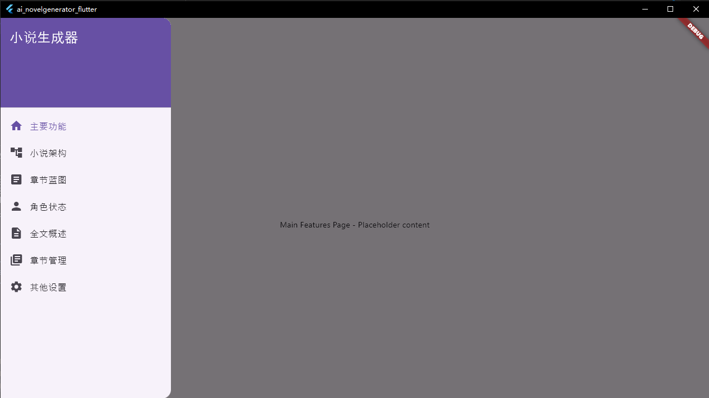

# AI小说生成器 Flutter版

一个基于Flutter开发的AI小说生成器应用程序，可以帮助用户快速生成小说内容、管理章节和角色等。

## 功能特性

- 自动生成小说内容
- 章节结构管理
- 角色状态跟踪
- 全文概览视图
- 章节管理功能
- 个性化设置
- 多语言支持（中英文）

## 界面预览



## 技术栈

- Flutter 3.x
- Dart
- Provider 状态管理
- Material Design 3
- 国际化支持 (i18n)

## 项目结构

```
lib/
├── main.dart                      # 应用入口文件
├── app/                           # 应用配置
│   ├── app.dart                   # 根组件
│   ├── routes.dart                # 路由管理
│   └── localizations/             # 国际化支持
├── data/                          # 数据层
│   ├── models/                    # 数据模型
│   ├── repositories/              # 数据仓库
│   └── datasources/               # 数据源
├── domain/                        # 业务层
│   ├── usecases/                  # 用例
│   └── services/                  # 业务服务
├── presentation/                  # UI层
│   ├── pages/                     # 页面
│   ├── widgets/                   # 通用组件
│   └── theme/                     # 主题配置
├── utils/                         # 工具类
└── assets/                        # 静态资源文件
```

## 安装与运行

### 环境要求

- Flutter 3.0 或更高版本
- Dart 2.17 或更高版本
- Android Studio / VS Code / IntelliJ IDEA (推荐)

### 安装步骤

1. 克隆项目到本地：
```bash
git clone <项目地址>
```

2. 进入项目目录：
```bash
cd ai_novelgenerator_flutter
```

3. 获取依赖包：
```bash
flutter pub get
```

4. 运行应用程序：
```bash
# 运行在Chrome浏览器上
flutter run -d chrome

# 运行在Windows桌面端
flutter run -d windows

# 运行在Android设备上
flutter run -d android
```

## 使用说明

1. **导航栏操作**：
   - 点击左上角菜单图标可打开导航栏
   - 在导航栏中选择不同的功能模块
   - 当前支持7个主要功能模块：
     - **主要功能**：应用的核心功能入口
     - **小说架构**：构建小说的整体结构
     - **章节蓝图**：设计具体章节的内容蓝图
     - **角色状态**：管理小说中的角色信息
     - **全文概述**：查看小说的完整内容概览
     - **章节管理**：管理各个章节的内容
     - **其他设置**：应用的其他配置选项

2. **页面切换**：
   - 应用会根据导航栏的选择自动切换到对应页面
   - 页面标题会动态更新以反映当前所在的功能模块

## 国际化支持

本项目支持多语言切换，目前支持：
- 简体中文
- 英语

语言会根据系统设置自动切换，也可以在设置中手动更改。

## 开发指南

### 添加新页面

1. 在 `lib/presentation/pages/` 目录下创建新的页面文件
2. 在 `lib/app/routes.dart` 中添加路由配置
3. 在 `lib/presentation/widgets/navigation_drawer.dart` 中添加导航项
4. 在 `lib/presentation/pages/home_page.dart` 中添加页面引用和标题

### 添加新翻译

1. 修改 `assets/i18n/zh.json` 文件添加中文翻译
2. 修改 `assets/i18n/en.json` 文件添加英文翻译
3. 在需要使用的地方通过 `AppLocalizations.of(context).translate('key')` 调用

## 贡献

欢迎提交Issue和Pull Request来改进这个项目。

## 许可证

本项目采用GNU Affero General Public License v3.0 (AGPL-3.0)许可证。

### 商业使用声明

本项目仅供个人学习和非商业用途使用。如需将本项目用于商业用途，必须获得版权所有者的明确授权并支付相应费用。

详细信息请参阅：
- [LICENSE](LICENSE) - AGPL-3.0许可证全文
- [COMMERCIAL_LICENSE.md](COMMERCIAL_LICENSE.md) - 商业许可证说明

### 联系方式

如需获得商业许可证或有任何疑问，请联系：

Email: your-email@example.com